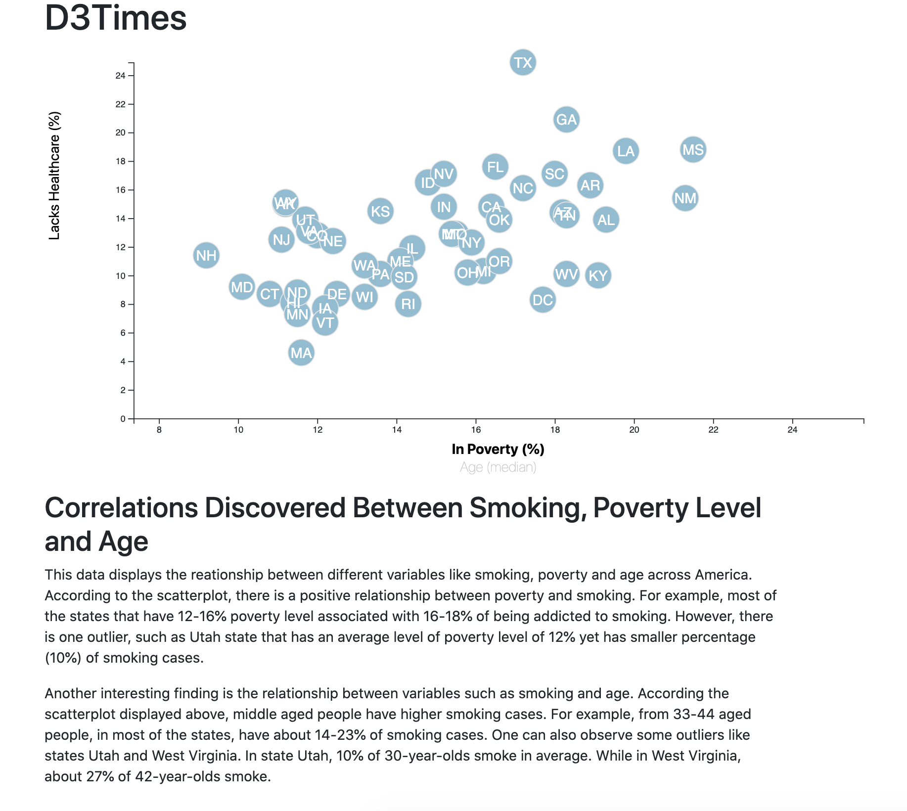
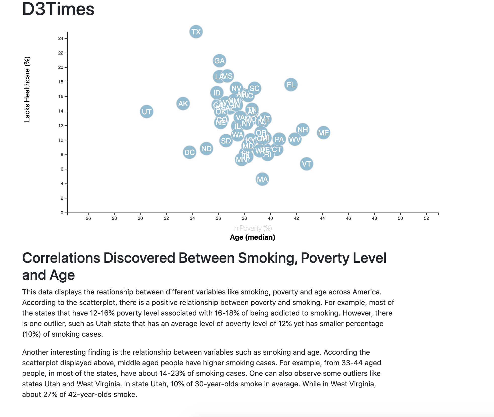

# D3 Homework - Data Journalism and D3

# D3-Challenge
## Tasks to Complete:

I wanted to analyze the relationship between some factors given in the dataset. Specifically, I wanted to see how  scatter plots between two of the data variables such as `Healthcare vs. Poverty` and `Lack of Healthcare vs. Age` looks like.

Using the D3 techniques we learned in class, I created a scatter plot that represents each state with circle elements. I coded this graphic in the `app.js` file of my assignment directory by making sure I pulled in the data from `data.csv` by using the `d3.csv` function. 

The scatterplot includes the following:

* State abbreviations in the circles.

* Create and situate your axes and labels to the left and bottom of the chart.

* Below each scatterplot, I have included a summary of my observation.

Here are the screenshots of how these scatterplots look like:

### 1. Relationship between lack of healthcare and poverty level across United States

### 2. Relationship between lack of healthcare and median age level across United States

