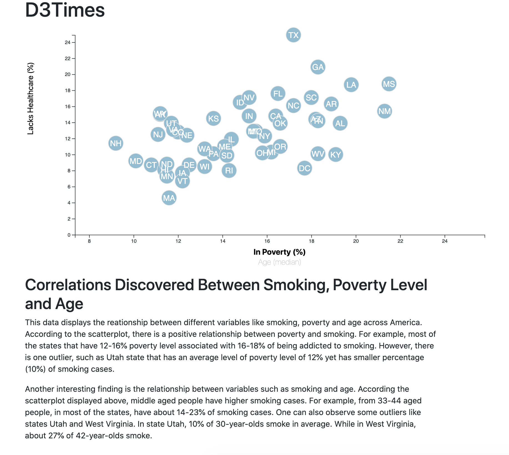
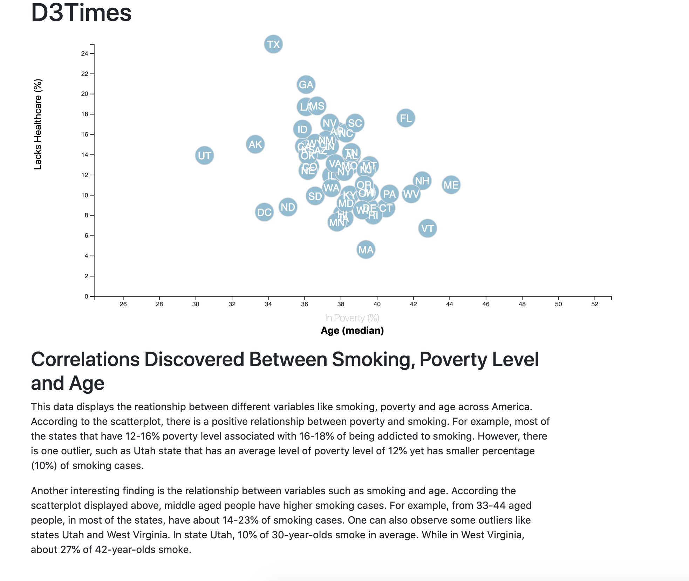

# D3 Homework - Data Journalism and D3

# D3-Challenge
## Task to Complete

You need to create a scatter plot between two of the data variables such as `Healthcare vs. Poverty` or `Smokers vs. Age`.

Using the D3 techniques we taught you in class, create a scatter plot that represents each state with circle elements. You'll code this graphic in the `app.js` file of your homework directory—make sure you pull in the data from `data.csv` by using the `d3.csv` function. Your scatter plot should ultimately appear like the image at the top of this section.

* Include state abbreviations in the circles.

* Create and situate your axes and labels to the left and bottom of the chart.

You need to create a scatter plot between two of the data variables such as `Healthcare vs. Poverty` or `Smokers vs. Age`.

Using the D3 techniques we taught you in class, create a scatter plot that represents each state with circle elements. You'll code this graphic in the `app.js` file of your homework directory—make sure you pull in the data from `data.csv` by using the `d3.csv` function. Your scatter plot should ultimately appear like the image at the top of this section.

* Include state abbreviations in the circles.

* Create and situate your axes and labels to the left and bottom of the chart.
